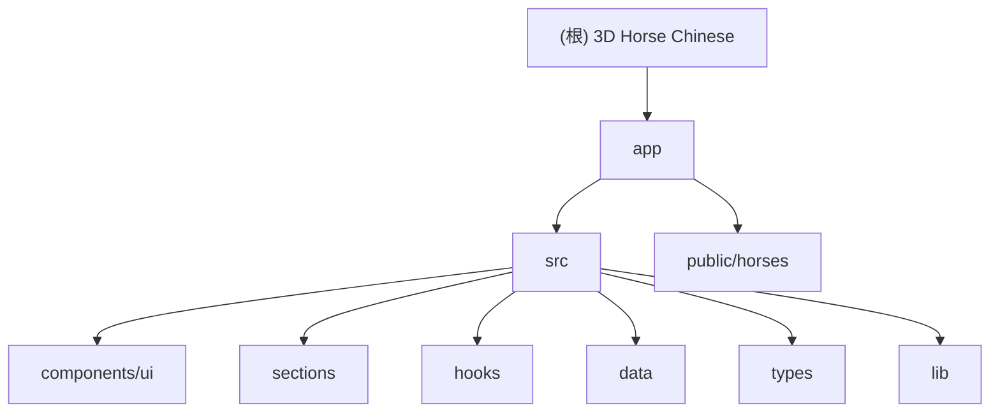

# 3D Horse Chinese - 马年3D壁纸生成器

> 基于 Chromostereopsis 色立体错觉原理的裸眼3D手机壁纸生成器

---

## 变更记录 (Changelog)

| 日期 | 版本 | 变更内容 |
|------|------|----------|
| 2026-02-04 | 1.0.0 | 初始文档生成，完成全仓扫描与模块分析 |

---

## 项目愿景

**3D Horse Chinese** 是一个专为2026马年设计的互动式手机壁纸生成应用。它利用色立体错觉（Chromostereopsis）科学原理，让用户无需佩戴3D眼镜即可体验立体视觉效果。应用提供200+马年祝福语和50款精美骏马图案，一键生成专属高清手机壁纸。

### 核心特性

- **裸眼3D效果**：基于玫红（前进）与蓝色（后退）的色差效应
- **200+祝福语**：涵盖经典成语、新年祝福、事业财运、爱情婚姻等13个分类
- **50款马图案**：AI生成的剪纸、年画、水墨、皮影等传统风格
- **1080P高清输出**：适配绝大多数手机屏幕尺寸

---

## 架构总览

```
3d_horse_cn/
├── app/                          # 前端应用模块（Vite + React + TypeScript）
│   ├── src/
│   │   ├── components/ui/        # shadcn/ui 组件库（50+组件）
│   │   ├── sections/             # 页面区块组件
│   │   ├── hooks/                # 自定义 React Hooks
│   │   ├── data/                 # 静态数据（祝福语、马图案）
│   │   ├── types/                # TypeScript 类型定义
│   │   └── lib/                  # 工具函数
│   └── public/                   # 静态资源（马图案PNG）
└── CLAUDE.md                     # 本文件
```

---

## 模块结构图



---

## 模块索引

| 模块路径 | 语言/框架 | 职责描述 | 入口文件 |
|----------|-----------|----------|----------|
| `/app` | TypeScript/React | 前端应用主模块，包含UI、逻辑和数据 | `src/main.tsx` |

---

## 技术栈

### 核心框架
- **React 19** - UI框架
- **TypeScript 5.9** - 类型系统
- **Vite 7** - 构建工具

### UI组件
- **shadcn/ui** - 组件库（50+组件）
- **Radix UI** - 无头组件基座
- **Tailwind CSS 3.4** - 样式框架
- **Lucide React** - 图标库

### 状态与表单
- **React Hook Form** - 表单管理
- **Zod** - 数据校验

### 开发工具
- **ESLint 9** - 代码检查
- **TypeScript ESLint** - TS规则

---

## 运行与开发

### 环境要求
- Node.js 18+
- npm 或 yarn

### 安装依赖
```bash
cd app
npm install
```

### 开发模式
```bash
npm run dev
```

### 生产构建
```bash
npm run build
```

### 代码检查
```bash
npm run lint
```

---

## 测试策略

当前项目未配置自动化测试框架。建议添加：

- **Vitest** - 单元测试
- **React Testing Library** - 组件测试
- **Playwright** - E2E测试

---

## 编码规范

- **TypeScript**: 严格模式开启
- **ESLint**: 使用 typescript-eslint 推荐配置
- **组件**: 使用函数组件 + Hooks
- **样式**: Tailwind CSS 工具类优先
- **导入**: 使用 `@/` 路径别名

---

## AI 使用指引

### 修改3D效果参数
编辑 `/app/src/hooks/useHorseYear3D.ts` 中的 `EFFECTS` 常量：

```typescript
const EFFECTS = {
  fontSize: 140,        // 前景字体大小
  bgFontSize: 180,      // 后景字体大小
  blurAmount: 1.5,      // 后景模糊程度
  shadowOffset: 3,      // 前景投影偏移
  horseSize: 500,       // 马图案大小
};
```

### 添加新祝福语
编辑 `/app/src/data/horsePhrases.ts`，在 `horsePhrases` 数组中添加：

```typescript
{ foreground: '新祝福语', background: '辅助说明\n第二行' }
```

### 添加新马图案
1. 将PNG文件放入 `/app/public/`
2. 在 `horseImages` 数组中添加路径：`'/horse-51.png'`

### 修改配色方案
编辑 `/app/src/hooks/useHorseYear3D.ts` 中的 `COLORS`：

```typescript
const COLORS = {
  foreground: '#ff0192',  // 前景色（玫红）
  background: '#00009b',  // 后景色（深蓝）
  middle: '#0500fc',      // 中间色（标准蓝）
};
```

---

## 相关文件清单

### 配置文件
- `/app/package.json` - 依赖与脚本
- `/app/vite.config.ts` - Vite配置
- `/app/tsconfig.json` - TypeScript配置
- `/app/tailwind.config.js` - Tailwind配置
- `/app/eslint.config.js` - ESLint配置
- `/app/components.json` - shadcn/ui配置

### 核心源码
- `/app/src/main.tsx` - 应用入口
- `/app/src/App.tsx` - 根组件
- `/app/src/hooks/useHorseYear3D.ts` - 核心3D渲染逻辑
- `/app/src/data/horsePhrases.ts` - 祝福语与马图案数据

### 组件
- `/app/src/sections/HorsePreview.tsx` - 预览组件
- `/app/src/sections/HorseGallery.tsx` - 图库组件
- `/app/src/sections/HorseInfo.tsx` - 信息说明组件
- `/app/src/components/ui/*.tsx` - UI组件库

---

## 覆盖率报告

### 扫描统计

| 指标 | 数值 |
|------|------|
| 总文件数估算 | ~120 个 |
| 已扫描文件数 | ~35 个 |
| 覆盖率 | ~29% |

### 已覆盖内容

- [x] 项目根配置文件
- [x] 入口文件 (main.tsx, App.tsx)
- [x] 核心Hooks (useHorseYear3D.ts, useStereo3D.ts, use-mobile.ts)
- [x] 数据文件 (horsePhrases.ts)
- [x] 类型定义 (types/index.ts)
- [x] 主要Section组件 (HorsePreview, HorseGallery, HorseInfo, Header)
- [x] 构建配置 (vite.config.ts, tsconfig.json, tailwind.config.js)
- [x] 代码质量配置 (eslint.config.js)

### 主要缺口

- [ ] UI组件详细实现（50+个shadcn/ui组件未逐一阅读）
- [ ] 静态资源文件（horse-*.png图片，仅记录路径）
- [ ] 测试文件（项目未配置测试）

### 被忽略/跳过的内容

| 类型 | 原因 |
|------|------|
| `node_modules/` | 依赖目录 |
| `dist/` | 构建输出 |
| `horse-*.png` | 二进制图片文件 |
| `.git/` | 版本控制 |

---

## 下一步建议

如需深入理解，建议优先补扫：

1. **`/app/src/components/ui/`** - 了解UI组件库的具体实现
2. **`/app/src/hooks/useStereo3D.ts`** - 了解通用3D效果Hook
3. **`/app/src/sections/ControlPanel.tsx`** - 了解控制面板实现（如存在）

---

*文档生成时间: 2026-02-04*
